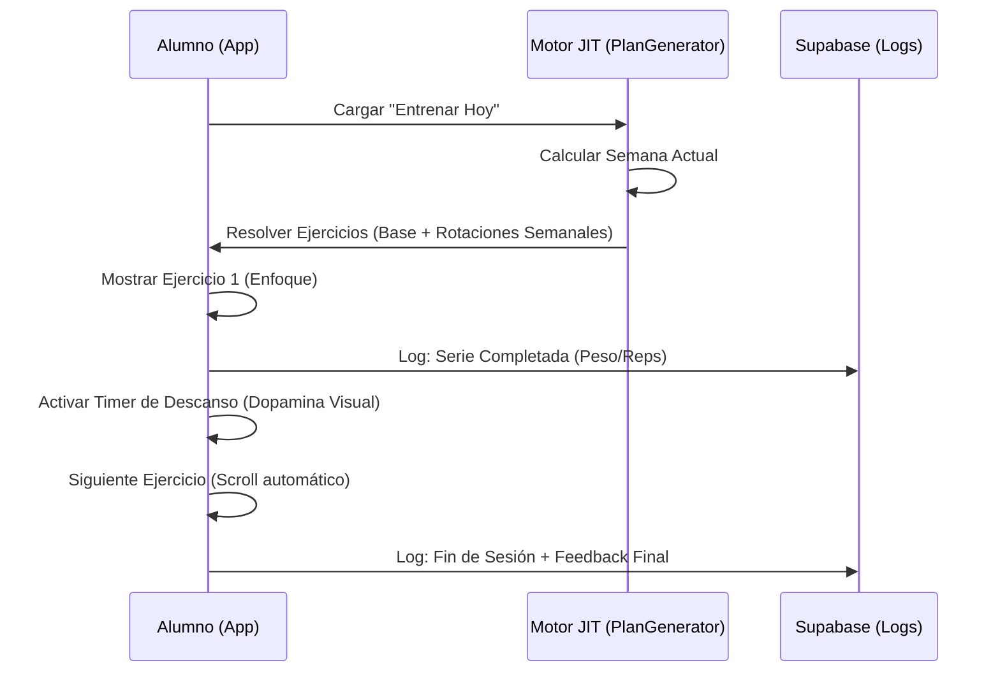

# 📱 Experiencia del Alumno: Evolución del Diseño

Este documento registra el viaje de MiGym desde su concepción visual hasta la implementación real del dashboard de alto rendimiento para atletas.

---

## 1. Fase 1: Visión Original (Draft v1) 🏎️

La visión inicial de MiGym para el alumno se inspiró en la estética **High-energy gaming** (Fast & Furious vibes), con el objetivo de generar una "dopamina inmediata" mediante el entrenamiento.

- **Filosofía**: "La Rutina Está Viva" (Just-in-Time). El alumno no recibe un PDF, recibe un cockpit dinámico.
- **Metas Visuales**:
    - Profundidad mediante `glassmorphism`.
    - Sombras neón (`shadow-lime-500/20`).
    - Animaciones de pulso al completar series.
- **Thumb Zone**: Diseño 100% operable con una sola mano para no soltar la mancuerna.

---

## 2. Fase 2: Implementación Real (Astro 6 / v2.0) 🛠️

La realidad técnica evolucionó el diseño hacia un estilo **Industrial Minimalist**, más crudo y eficiente, pero manteniendo los acentos neón de la visión original.

### Sistema de Diseño (Realidad) 🏁
- **Fuentes**: **Geist** (Headings) e **Inter** (Body). Decidimos cambiar *Plus Jakarta Sans* para lograr una estética más técnica y legible en pantallas pequeñas.
- **Paleta de Colores**: 
    - **Fondo**: `bg-black` puro (para máximo contraste y ahorro de batería OLED).
    - **Acentos**: `lime-400` (Éxito) y `fuchsia-500` (Variaciones/Rotación).
- **Componentes Core**:
    - `ActiveSession.tsx`: Orquesta la sesión en vivo manejando el estado de ejercicios y tiempos de descanso.
    - `PlanGenerator.ts`: El motor JIT que resuelve qué ejercicio toca "hoy" según la semana del alumno.

### Voz y Tono (Argentina 🇦🇷)
Implementado con **Voseo Rioplatense** para una sensación de coach personal:
- **"Dale, sacá una más. Vos sabés que podés."**
- **"Hiciste la sesión. Sos una máquina. 💪"**
- **"Revisá tu progreso semanal."**

---

## 3. Lecciones Aprendidas: El cambio a Geist 🧠

Durante la implementación, descubrimos que las fuentes con demasiada personalidad (como *Plus Jakarta Sans*) distraían en el tracker de sesión, donde el número de reps y el peso son sagrados. Cambiamos a **Geist** por su espaciado técnico y su peso `font-black`, que permite que los labels en `uppercase` se sientan como el tablero de un auto de carreras sin sacrificar la sobriedad industrial.

---

## 4. Flujo de la Sesión Activa (JIT Flow) 📡

---

## 5. Arquitectura de Doble Capa (Personalización Eficiente) 🧬

Para escalar MiGym, implementamos un sistema de **Doble Capa** que separa la logística del profesor de la realidad física del alumno.

### Capa 1: Estructura (Plan Maestro)
- **Propósito**: Definir el "esqueleto" del entrenamiento (qué ejercicios, en qué orden y qué días).
- **Consistencia**: Un Plan Maestro (ej: "Hipertrofia 4 Días") es agnóstico al alumno. **No contiene métricas** (series, reps, peso).
- **SSOT**: Tabla `ejercicios_plan`.

### Capa 2: Personalización (Metrics Overrides)
- **Propósito**: Adaptar el plan a la capacidad real del alumno.
- **Datos**: Aquí viven las **Series, Repeticiones, Peso y Descanso**.
- **SSOT**: Tabla `ejercicio_plan_personalizado`. Los datos se vinculan por `alumno_id` + `ejercicio_plan_id`.

### El Proceso de Fusión (The Merge)
Cuando el alumno abre "Entrenar Hoy", el sistema realiza un merge en tiempo real:
1. Lee la **Estructura** del Plan Maestro asignado.
2. Busca **Overrides** de métricas específicos para ese alumno.
3. Si existen, los inyecta. Si no, usa valores base (o pide al coach definirlos).

> [!TIP]
> **Protección de Plantillas**: Si el profesor realiza un cambio **Estructural** (ej: borra un ejercicio) en la ficha de un alumno, el sistema detecta que es un Plan Maestro y ofrece crear un **Fork** (Plan Privado) para no romper la plantilla global.

---

## 6. Fase 3: Roadmap e Inmersión (Futuro) 🚀

Para las versiones v2.1 y superiores, el equipo tiene planeado profundizar la inmersión:
- **Grid de Fondo**: Un patrón táctico de puntos (opacity 5%) para reforzar la estética industrial.
- **Vibración Haptica**: Feedback físico al terminar el descanso o completar el volumen total del plan.
- **Modo Offline**: Sincronización diferida para gimnasios en sótanos sin señal.

---

**Última actualización:** Abril 2026  
**Versión:** 2.0 (Registro de Evolución)  
**Owner:** NODO Studio | MiGym
