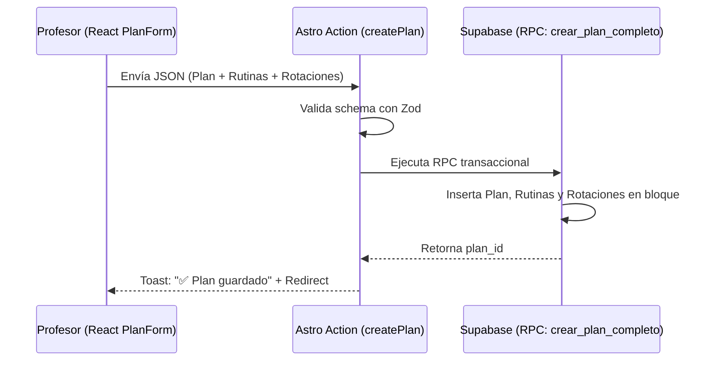
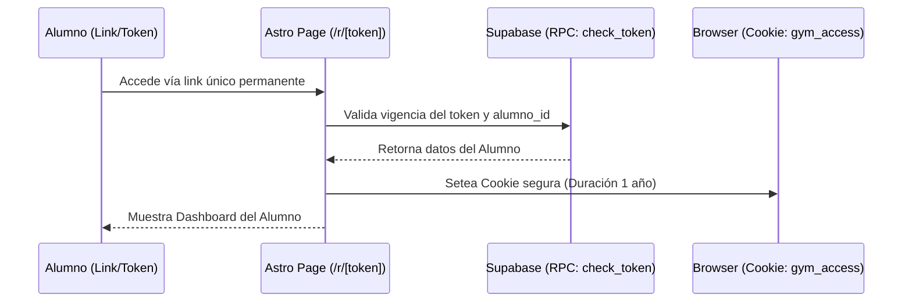
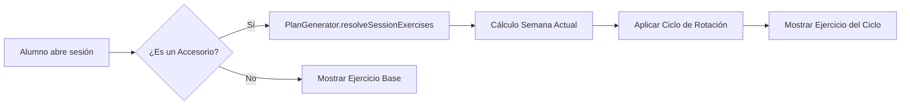

# 🏗️ MiGym: System Architecture (v2.0)

## Visión General

MiGym es una plataforma SaaS de alto rendimiento para la gestión deportiva. La arquitectura está diseñada para maximizar la velocidad de carga y la simplicidad operativa, basada en la filosofía **"ADN vs. Organismo Vivo"**.

---

## 🧬 Filosofía: ADN vs. Organismo Vivo

Para garantizar la escalabilidad y la integridad de los datos, el sistema se divide en dos capas conceptuales:

### 1. El ADN (Plan Maestro / Template)
Es la estructura fundamental e inmutable del entrenamiento.
- **Definición**: Se gestiona desde la sección de **Planes/Templates**.
- **Propiedad**: Pertenece al Profesor como recurso de diseño.
- **Regla de Oro**: Ninguna acción desde el dashboard operativo del alumno (Agenda) puede alterar el ADN de forma accidental.
- **Entidades**: `planes`, `rutinas_diarias`, `ejercicios_plan`.

### 2. El Organismo Vivo (Agenda / Instancia)
Es la ejecución diaria, adaptativa y reactiva del entrenamiento.
- **Definición**: Se materializa cuando el alumno "vive" el plan día a día.
- **Propiedad**: Pertenece a la relación Profesor-Alumno en el tiempo real.
- **Adaptabilidad**: Permite swaps, omisiones, personalizaciones de peso/reps y ajustes por imprevistos ("Sólo por hoy") sin contaminar el ADN original.
- **Entidades**: `sesiones_instanciadas`, `sesion_ejercicios_instanciados`, `ejercicio_plan_personalizado`.

---

## 🛠️ Stack Tecnológico

| Capa | Tecnología | Propósito | Razón |
|------|-----------|----------|-------|
| **Frontend Framework** | Astro 6 (SSR + Islands) | Renderizado híbrido | Máximo rendimiento (LCP < 500ms). Islands de React solo para formularios complejos. |
| **UI Library** | React 19 + Radix UI | Componentes interactivos | Estándar de la industria, alto rendimiento y accesibilidad. |
| **Styling** | Tailwind CSS v4 | Diseño industrial minimalista | Utilidad-first nativo, variables CSS de alto rendimiento. |
| **State Management** | React Hooks + Astro Actions | Mutaciones tipo-safe | Sin Redux/Zustand global. Estado local + validación en servidor vía Zod. |
| **Backend / BaaS** | Supabase (Postgres + Auth) | Infraestructura serverless | Row-Level Security (RLS) para aislamiento de datos. |
| **Database** | PostgreSQL | RDBMS Relacional | Integridad referencial mandatoria para planes, alumnos y sesiones. |
| **Auth Híbrida** | Supabase + Cookie Token | Acceso persistente | Magic Links (Profesores) y "Modo Barrio" vía Tokens (Alumnos). |

---

## 📊 Modelo de Datos (ERD Real)

### Entidades de Entrenamiento
- **PLAN**: Plantilla maestra que define la estructura (frecuencia, duración).
- **PLAN_ROTACIONES**: Ciclos de ejercicios accesorios (JIT).
- **EJERCICIOS_PLAN**: Instancias de ejercicios con carga (Series, Reps, RPE/Target).
- **BIBLIOTECA_EJERCICIOS**: Catálogo global del profesor (Vídeos, Tags, Variantes).

### Entidades de Ejecución
- **ALUMNOS**: Perfil del atleta, vinculado a un plan y una fecha de inicio.
- **SESIONES**: Instancias diarias generadas "al vuelo" o pre-programadas.
- **EJERCICIO_LOGS**: Registro real de peso, reps y RPE del alumno.
- **PAGOS**: Seguimiento de cuotas e inyección virtual de morosidad.

---

## 🔄 Flujos de Datos (Mermaid Diagrams)

### 1. Creación de Plan (Proceso Completo)

### 2. Acceso Alumno (Modo Barrio)

### 3. Resolución JIT de Sesión

---

## 🏗️ Estructura de Proyecto (Atomic Design)

Siguiendo una metodología estricta de componentes reutilizables:

- **`/atoms`**: Elementos indivisibles (`Badge`, `IconWrapper`, `ProgressBar`).
- **`/molecules`**: Agrupaciones funcionales (`SearchInput`, `UserAvatar`, `ExerciseCard`).
- **`/organisms`**: Bloques con estado/lógica (`PlanForm`, `TablaPagos`, `ExerciseLibrary`).
- **`/templates`**: Estructuras de página reutilizables.
- **`/pages`**: Orquestación final en Astro (Rutas).

---

## 🚀 Extensibilidad Futura (Prioridades v2.1)

1. **Lazy Generation Worker**: Proceso en fondo para pre-generar las sesiones de la semana cada Lunes, optimizando la visualización de "Próximos días".
2. **Sistema de Personalizaciones (Scenario B/C)**: Interfaz para que el profesor asigne variaciones por feriados o ausencias directamente desde el dashboard.
3. **WhatsApp Engine**: Integración con API oficial para envíos de recordatorios de pago y alertas de nueva rutina.
4. **Modo Offline**: Service Workers para permitir que el alumno use la app en gimnasios con mala conexión sin perder logs.

---

## 📋 Checklist de Infraestructura
- [x] **Astro Actions**: Centralizado para todas las mutaciones.
- [x] **DB Schema v2**: Soporte para rotaciones y variaciones.
- [x] **RLS Hardening**: Protección de datos por `profesor_id` y `alumno_id`.
- [x] **Zod Validators**: SSOT en `src/lib/validators.ts`.

---

**Última actualización:** Abril 2026  
**Versión:** 2.0 (Astro 6 Ready)  
**Owner:** NODO Studio | MiGym